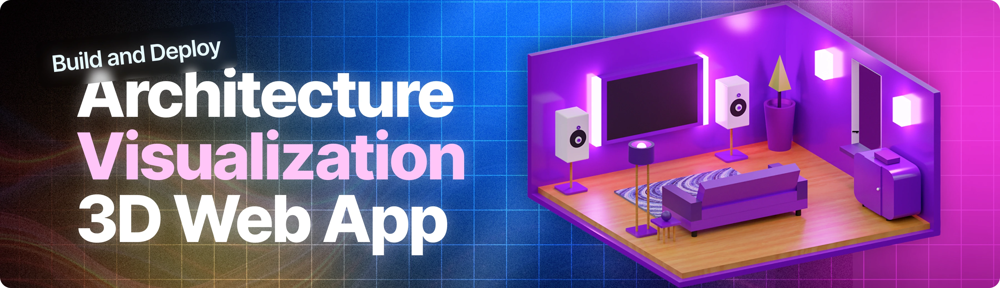

   
    
   

  

 

  

  <h3 align="center">Roomify | AI-powered Architectural Visualization App</h3>

## 📋 <a name="table">Table of Contents</a>

1. ✨ [Introduction](#introduction)
2. ⚙️ [Tech Stack](#tech-stack)
3. 🔋 [Features](#features)
4. 🤸 [Quick Start](#quick-start)
5. 🔗 [Assets](#links)
6. 🚀 [More](#more)

## <a name="introduction">✨ Introduction</a>

AI-powered architectural visualization SaaS built with React, TypeScript, and Puter. Use AI models from Claude to Gemini to transform 2D floor plans into photorealistic 3D renders with permanent hosting and persistent metadata. This project features 2D-to-3D photorealistic rendering, serverless workers, high-performance KV storage, and a global community feed.

## <a name="tech-stack">⚙️ Tech Stack</a>
- **[React](https://react.dev/)** is a popular JavaScript library for building user interfaces, specifically for creating single-page applications with a component-based architecture.

- **[Vite](https://vitejs.dev/)** is a next-generation frontend tool that provides an extremely fast development environment and optimized build process for modern web projects.

- **[TypeScript](https://www.typescriptlang.org/)** is a strongly typed superset of JavaScript that adds static types, helping developers catch errors early and write more maintainable code.

- **[TailwindCSS](https://tailwindcss.com/)** is a utility-first CSS framework that allows for rapid UI development by applying pre-defined classes directly in your markup.

- **[Puter](https://jsm.dev/roomify-puter)** is the underlying cloud computing platform and "Internet OS" that provides the infrastructure; including serverless Workers, permanent file storage, key-value (KV) databases, and hosted AI models.

- **[Puter.js](https://roomify-puterjs)** is the official JavaScript SDK that allows developers to interact with those cloud services directly from the frontend.

- **[CodeRabbit](https://coderabbit)** is an AI-powered code review platform that provides deep insights and automated suggestions to improve code quality and security.

- **[Junie by JetBRains](https://roomify-junie)** is an AI-driven coding assistant integrated into the development environment to help automate complex logic, refactoring, and prompt engineering.

- **[Claude](https://www.anthropic.com/claude)** and **[Gemini](https://deepmind.google/technologies/gemini/)** are state-of-the-art large language models used to power the architectural transformation and image generation logic within the application.

## <a name="features">🔋 Features</a>
👉 **2D-to-3D Visualization**: Instant architectural rendering that transforms flat floor plans into photorealistic 3D models using state-of-the-art AI.

👉 **Persistent Media Hosting**: Permanent file storage that generates public URLs for every upload and output, ensuring your renders are always accessible.

👉 **Dynamic Project Gallery**: A personalized workspace that tracks your history of visualizations with instant loading and metadata persistence.

👉 **Side-by-Side Comparison**: Interactive tools designed to visualize the direct transformation from a source architectural sketch to its AI-rendered counterpart.

👉 **Global Community Feed**: A public discovery engine where users share their architectural projects with the world in a single click.

👉 **Privacy Controls**: Granular public and private toggles that give users full authority over the visibility and security of their architectural data.

👉 **Ownership Mapping**: A clean metadata system that tracks project details and user IDs across the entire platform for seamless account management.

👉 **Modern Export Functionality**: High-performance tools to download and move AI-generated renders into real-world presentations and workflows.

